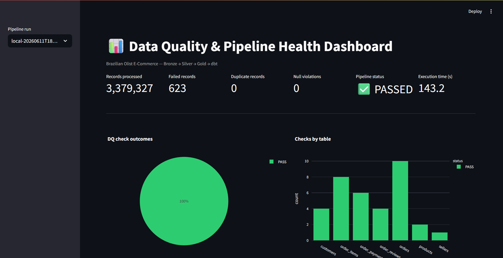
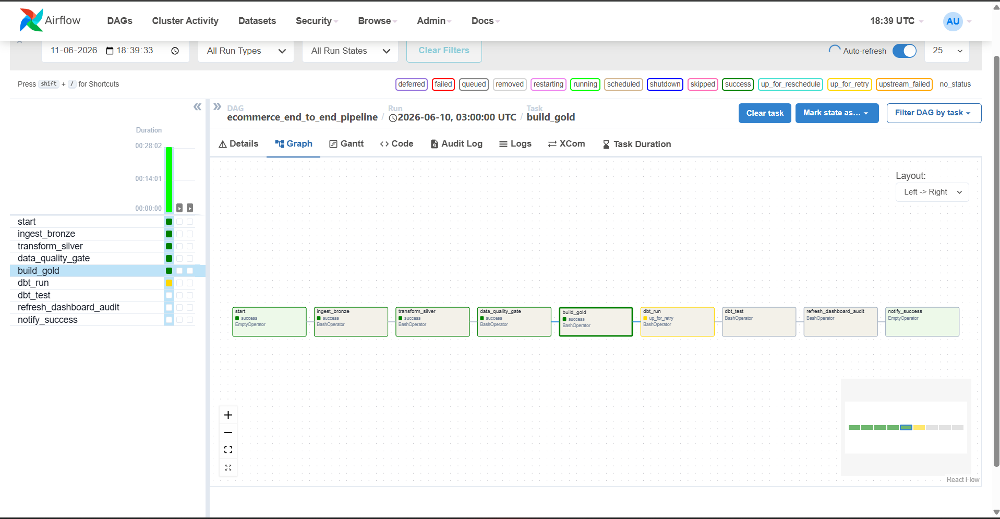

# 🛒 E-Commerce Data Pipeline (Brazilian Olist)

A **production-grade, end-to-end Data Engineering project** that ingests raw Brazilian
e-commerce data, processes it with **PySpark**, lands it in **BigQuery** following the
**Medallion Architecture (Bronze → Silver → Gold)**, orchestrates everything with
**Apache Airflow**, transforms analytics models with **dbt**, and exposes business-ready
reporting datasets for **Power BI / Looker Studio / Tableau**.

> Built to demonstrate the skill set expected of a **mid-level Data Engineer**:
> ETL/ELT design, distributed processing, data quality, orchestration, dimensional
> modelling, CI/CD, containerization, **CDC (Change Data Capture)** and observability.

---

## 📌 Table of Contents

1. [Screenshots](#-screenshots)
2. [Architecture](#-architecture)
3. [Tech Stack](#-tech-stack)
4. [Dataset](#-dataset)
5. [Project Structure](#-project-structure)
6. [Data Flow](#-data-flow)
7. [Medallion Layers](#-medallion-layers)
8. [Data Quality Framework](#-data-quality-framework)
9. [CDC Simulation](#-cdc-change-data-capture-simulation)
10. [Data Quality Dashboard](#-data-quality-dashboard)
11. [Quick Start](#-quick-start)
12. [Running the Pipeline](#-running-the-pipeline)
13. [dbt Models & Business Metrics](#-dbt-models--business-metrics)
14. [BigQuery Warehouse Design](#-bigquery-warehouse-design)
15. [CI/CD](#-cicd)
16. [Documentation](#-documentation)
17. [Roadmap](#-roadmap)

---

## 📸 Screenshots

> Live demo screenshots from running the full stack locally via Docker on the
> real Olist dataset (~100k orders, 1.55M rows). Drop your captures into
> [`docs/images/`](docs/images/) using the filenames below and they render here.

### Data Quality Dashboard
Streamlit dashboard reading the audit tables — records processed, failed records,
duplicates, null violations, pipeline status and per-stage execution time.



### Airflow — End-to-End Pipeline DAG
`ecommerce_end_to_end_pipeline` running green: Bronze → Silver → Data Quality
gate → Gold (dbt tasks require a BigQuery target).



### Airflow — CDC Daily DAG
`ecommerce_cdc_daily` applying daily incremental (insert/update/delete) batches.


<!-- Optional once BigQuery is wired up:
### dbt lineage & tests


### BigQuery Gold tables

### BI dashboard (Looker Studio / Power BI)

-->

See [`docs/screenshots.md`](docs/screenshots.md) for the full capture guide.

---

## 🏗 Architecture

```
                         ┌──────────────────────────────────────────────────────────┐
                         │                    APACHE AIRFLOW                          │
                         │        (orchestration · retries · SLA · alerts)            │
                         └───────┬───────────┬───────────┬───────────┬───────────────┘
                                 │           │           │           │
            ┌────────────────────▼──┐  ┌─────▼──────┐ ┌──▼────────┐ ┌▼────────────┐
  CSV /     │   BRONZE (Raw)        │  │  SILVER    │ │  GOLD     │ │   dbt       │
  Daily ───▶│   PySpark ingest      │─▶│ PySpark    │▶│ PySpark   │▶│  marts /    │
  CDC files │   schema inference    │  │ clean/std  │ │ business  │ │  metrics    │
            │   + raw audit         │  │ + DQ checks│ │ aggregates│ │  + tests    │
            └───────────────────────┘  └─────┬──────┘ └───────────┘ └──────┬──────┘
                                             │                              │
                                    ┌────────▼─────────┐          ┌─────────▼──────────┐
                                    │  DATA QUALITY    │          │   BigQuery (Gold)  │
                                    │  FRAMEWORK       │          │   partitioned +    │
                                    │  → audit tables  │          │   clustered tables │
                                    └────────┬─────────┘          └─────────┬──────────┘
                                             │                              │
                                    ┌────────▼──────────────────────────────▼──────────┐
                                    │   MONITORING · DQ DASHBOARD · DATA LINEAGE        │
                                    │   Power BI / Looker Studio / Tableau              │
                                    └──────────────────────────────────────────────────┘
```

Full diagrams: [`docs/architecture.md`](docs/architecture.md) ·
[`docs/data_flow.md`](docs/data_flow.md)

---

## 🧰 Tech Stack

| Layer            | Technology                                            |
|------------------|-------------------------------------------------------|
| Ingestion        | PySpark (CSV → Parquet/Delta-style)                   |
| Processing       | PySpark 3.5 (Bronze/Silver/Gold transformations)     |
| Data Warehouse   | Google BigQuery (partitioned + clustered)            |
| Orchestration    | Apache Airflow 2.9                                     |
| Transformation   | dbt-core + dbt-bigquery                                |
| Data Quality     | Custom PySpark DQ framework + dbt tests               |
| CDC              | Daily incremental file simulation + merge logic       |
| Monitoring       | Streamlit DQ dashboard + audit tables                 |
| Containerization | Docker + docker-compose                               |
| CI/CD            | GitHub Actions                                         |
| BI               | Power BI · Looker Studio · Tableau                    |

---

## 📦 Dataset

[Brazilian E-Commerce Public Dataset by Olist](https://www.kaggle.com/datasets/olistbr/brazilian-ecommerce)
— ~100k orders (2016–2018) across 9 relational CSV files:

| File                                       | Grain / Description                  |
|--------------------------------------------|--------------------------------------|
| `olist_orders_dataset.csv`                 | One row per order                    |
| `olist_order_items_dataset.csv`            | One row per item within an order     |
| `olist_order_payments_dataset.csv`         | Payment installments per order       |
| `olist_order_reviews_dataset.csv`          | Customer reviews                     |
| `olist_customers_dataset.csv`              | Customers (+ geolocation key)        |
| `olist_sellers_dataset.csv`                | Sellers                              |
| `olist_products_dataset.csv`               | Product catalog                      |
| `olist_geolocation_dataset.csv`            | Zip-code lat/long                    |
| `product_category_name_translation.csv`    | PT → EN category mapping             |

Download with [`scripts/download_data.sh`](scripts/download_data.sh) (requires a Kaggle API token).

---

## 📁 Project Structure

```
E-Commerce PySpark Pipeline/
├── airflow/                 # Airflow runtime config (Dockerfile, requirements)
├── dags/                    # Airflow DAGs (ingestion, DQ, transform, load, dbt, CDC)
├── pyspark_jobs/            # All Spark code
│   ├── common/              # logger, spark session, config loader, exceptions
│   ├── bronze/              # raw ingestion
│   ├── silver/              # cleaning / standardization
│   ├── gold/                # business aggregates
│   ├── transformations/     # reusable transformation modules
│   ├── data_quality/        # DQ framework + checks
│   └── cdc/                 # change data capture processor
├── dbt/                     # dbt project (staging / intermediate / marts)
├── sql/                     # BigQuery DDLs (bronze/silver/gold/audit)
├── configs/                 # YAML configs (pipeline, spark, bigquery, schemas)
├── monitoring/              # Streamlit DQ dashboard + lineage
├── scripts/                 # helper scripts (download, CDC generator, run jobs)
├── tests/                   # unit + integration tests
├── docs/                    # architecture, data flow, setup, deployment, dictionary
├── .github/workflows/       # CI/CD pipelines
├── docker-compose.yml
├── Makefile
├── requirements.txt
└── README.md
```

---

## 🔄 Data Flow

1. **Ingestion** — raw CSV (and daily CDC files) read by PySpark, schema-inferred,
   written to the **Bronze** layer with an ingest audit record.
2. **Cleaning** — Silver jobs handle nulls, type casting, dedup, standardization,
   date formatting and business-rule validation.
3. **Data Quality** — automated checks (nulls, dupes, PK uniqueness, referential
   integrity, invalid timestamps, missing FKs) write results to **audit tables**.
4. **Curation** — Gold jobs build conformed dimensions & facts and load BigQuery.
5. **Analytics** — dbt builds staging → intermediate → mart models and business metrics.
6. **Serving** — reporting tables consumed by BI tools; DQ dashboard for observability.

See [`docs/data_flow.md`](docs/data_flow.md).

---

## 🥉🥈🥇 Medallion Layers

| Layer  | Purpose                          | Format        | Example tables                          |
|--------|----------------------------------|---------------|-----------------------------------------|
| Bronze | Immutable raw, schema-on-read    | Parquet       | `bronze.orders`, `bronze.order_items`   |
| Silver | Cleaned, conformed, validated    | Parquet       | `silver.orders`, `silver.customers`     |
| Gold   | Business aggregates / star schema| BigQuery      | `gold.fct_orders`, `gold.dim_customers` |

---

## ✅ Data Quality Framework

A reusable, config-driven framework ([`pyspark_jobs/data_quality/`](pyspark_jobs/data_quality/))
runs the following check types and persists results to `audit.dq_results`:

- **Null checks** on required columns
- **Duplicate detection** on natural keys
- **Primary-key uniqueness**
- **Referential integrity** (FK → PK)
- **Invalid timestamp** detection (nulls, out-of-range, ordering violations)
- **Missing foreign-key references**

Each check emits: `run_id`, `table`, `check_type`, `column`, `records_scanned`,
`records_failed`, `status (PASS/WARN/FAIL)`, `threshold`, `executed_at`.

---

## 🔁 CDC (Change Data Capture) Simulation

Recruiters love this. The pipeline simulates **daily incremental loads**:

- [`scripts/generate_cdc_files.py`](scripts/generate_cdc_files.py) slices the full
  dataset into dated daily files with `INSERT` / `UPDATE` / `DELETE` operation flags.
- [`pyspark_jobs/cdc/cdc_processor.py`](pyspark_jobs/cdc/cdc_processor.py) applies a
  **merge (upsert + soft-delete)** into the Silver layer using `op` + `updated_at`,
  keeping only the latest version of each key.
- [`dags/cdc_daily_dag.py`](dags/cdc_daily_dag.py) runs it on a daily schedule.

---

## 📊 Data Quality Dashboard

A **Streamlit** dashboard ([`monitoring/dashboard/dq_dashboard.py`](monitoring/dashboard/dq_dashboard.py))
reads the audit tables and shows:

- **Total records processed**
- **Failed records**
- **Duplicate records**
- **Null violations**
- **Pipeline status** (per stage)
- **Execution time** per job

```bash
streamlit run monitoring/dashboard/dq_dashboard.py
```

---

## 🚀 Quick Start

```bash
# 1. Clone & configure
cp .env.example .env            # fill in GCP project, paths, Kaggle creds

# 2. Download the dataset (needs ~/.kaggle/kaggle.json)
bash scripts/download_data.sh

# 3. Spin up the stack (Airflow + Spark + dbt)
docker-compose up -d

# 4. Open Airflow
open http://localhost:8080      # user/pass: airflow / airflow
```

Full instructions: [`docs/setup.md`](docs/setup.md) · Deployment: [`docs/deployment.md`](docs/deployment.md)

---

## ▶ Running the Pipeline

Locally (without Docker):

```bash
make install            # install python deps
make generate-cdc       # create simulated daily files
make run-bronze         # raw ingestion
make run-silver         # clean + DQ checks
make run-gold           # business aggregates + BigQuery load
make dbt-run            # dbt models
make dbt-test           # dbt tests
make dashboard          # launch DQ dashboard
```

Or trigger the end-to-end DAG `ecommerce_end_to_end_pipeline` in Airflow.

---

## 🧱 dbt Models & Business Metrics

`dbt/models/` is organized into **staging → intermediate → marts**. Mart models deliver:

- **Revenue by month** (`mart_revenue_monthly`)
- **Top-selling categories** (`mart_top_categories`)
- **Customer retention** (`mart_customer_retention`)
- **Average order value** (`mart_avg_order_value`)
- **Delivery performance** (`mart_delivery_performance`)
- **Seller performance** (`mart_seller_performance`)

All marts include dbt **tests** (`not_null`, `unique`, `relationships`, custom) and
**docs**. See [`dbt/README.md`](dbt/README.md).

---

## 🗄 BigQuery Warehouse Design

DDLs in [`sql/`](sql/). Gold tables use:

- **Partitioning** on event/order date columns
- **Clustering** on high-cardinality filter keys (customer, seller, category)
- Conformed **star schema** (`fct_orders`, `dim_customers`, `dim_products`, `dim_sellers`, `dim_date`)

---

## 🔧 CI/CD

GitHub Actions in [`.github/workflows/`](.github/workflows/):

- `ci.yml` — lint (ruff/black), unit tests (pytest), Spark job smoke tests
- `dbt.yml` — `dbt compile` + `dbt test` against a CI dataset
- `cd.yml` — build & push Docker images, deploy DAGs

---

## 📚 Documentation

| Doc | Description |
|-----|-------------|
| [`docs/architecture.md`](docs/architecture.md) | System & medallion architecture diagrams |
| [`docs/data_flow.md`](docs/data_flow.md)        | End-to-end data flow |
| [`docs/setup.md`](docs/setup.md)                | Local + Docker setup |
| [`docs/deployment.md`](docs/deployment.md)      | GCP / production deployment |
| [`docs/data_dictionary.md`](docs/data_dictionary.md) | Field-level data dictionary |
| [`docs/screenshots.md`](docs/screenshots.md)    | Where to place portfolio screenshots |

---

## 🗺 Roadmap

- [ ] Replace Parquet Silver with Delta Lake / Iceberg for true ACID CDC
- [ ] Great Expectations integration alongside custom DQ framework
- [ ] Streaming ingestion (Kafka) for near-real-time orders
- [ ] Terraform IaC for the GCP footprint

---

## 📝 License

MIT — see [`LICENSE`](LICENSE). Dataset © Olist, released on Kaggle under CC BY-NC-SA 4.0.
