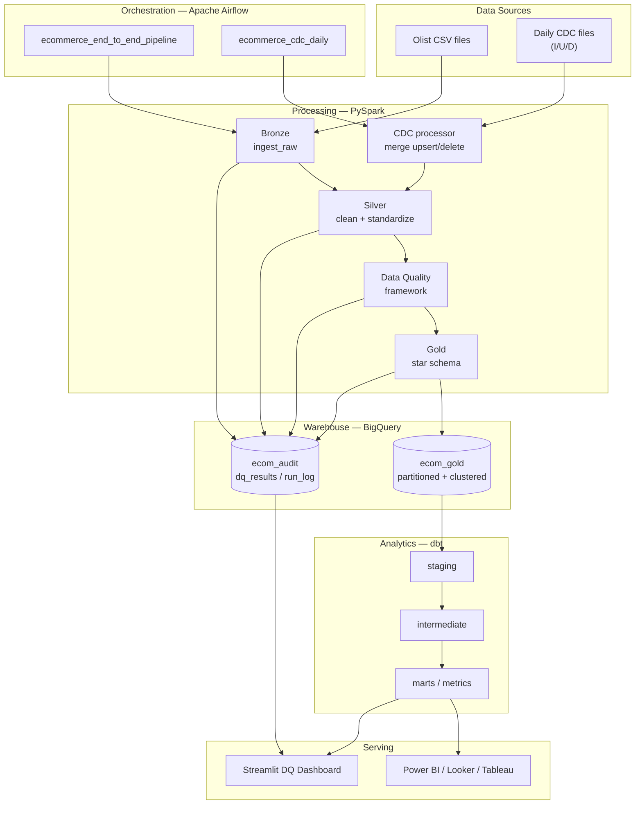
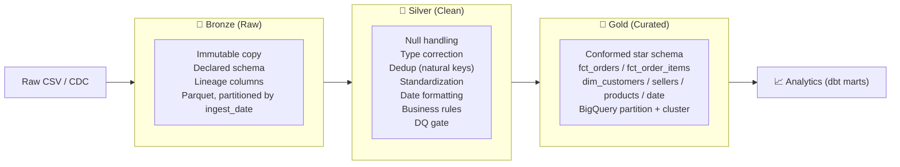
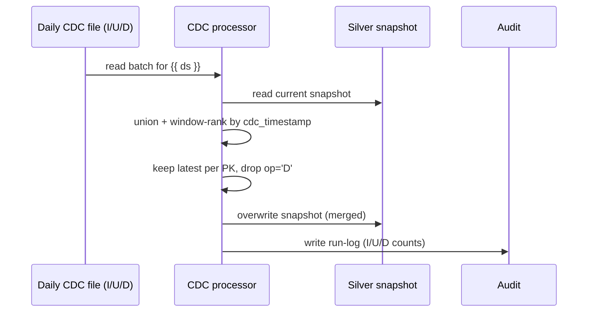

# Architecture

## 1. System Architecture

## 2. Medallion Architecture

## 3. Layer responsibilities

| Layer  | Tech     | Storage             | Idempotent? | Notes |
|--------|----------|---------------------|-------------|-------|
| Bronze | PySpark  | Parquet (`bronze/`) | Yes (overwrite) | Schema-on-write, lineage stamped |
| Silver | PySpark  | Parquet (`silver/`) | Yes / CDC-merge | Cleaning + DQ gate + CDC target |
| Gold   | PySpark  | BigQuery (`ecom_gold`) | Yes | Partitioned/clustered star schema |
| Marts  | dbt      | BigQuery (`*_marts`)| Yes | Business metrics + tests |
| Audit  | PySpark/BQ | `ecom_audit`      | Append | DQ results + run log |

## 4. Data Quality gate

The Silver→Gold transition is **gated**: `pyspark_jobs.data_quality.run_dq`
runs the declarative rules in `configs/dq_rules.yaml`. Any `FAIL`-severity check
that breaches its threshold raises `DataQualityError`, which fails the Airflow
task and stops the pipeline before bad data reaches BigQuery. All results
(pass and fail) are written to `audit.dq_results`.

## 5. CDC flow

