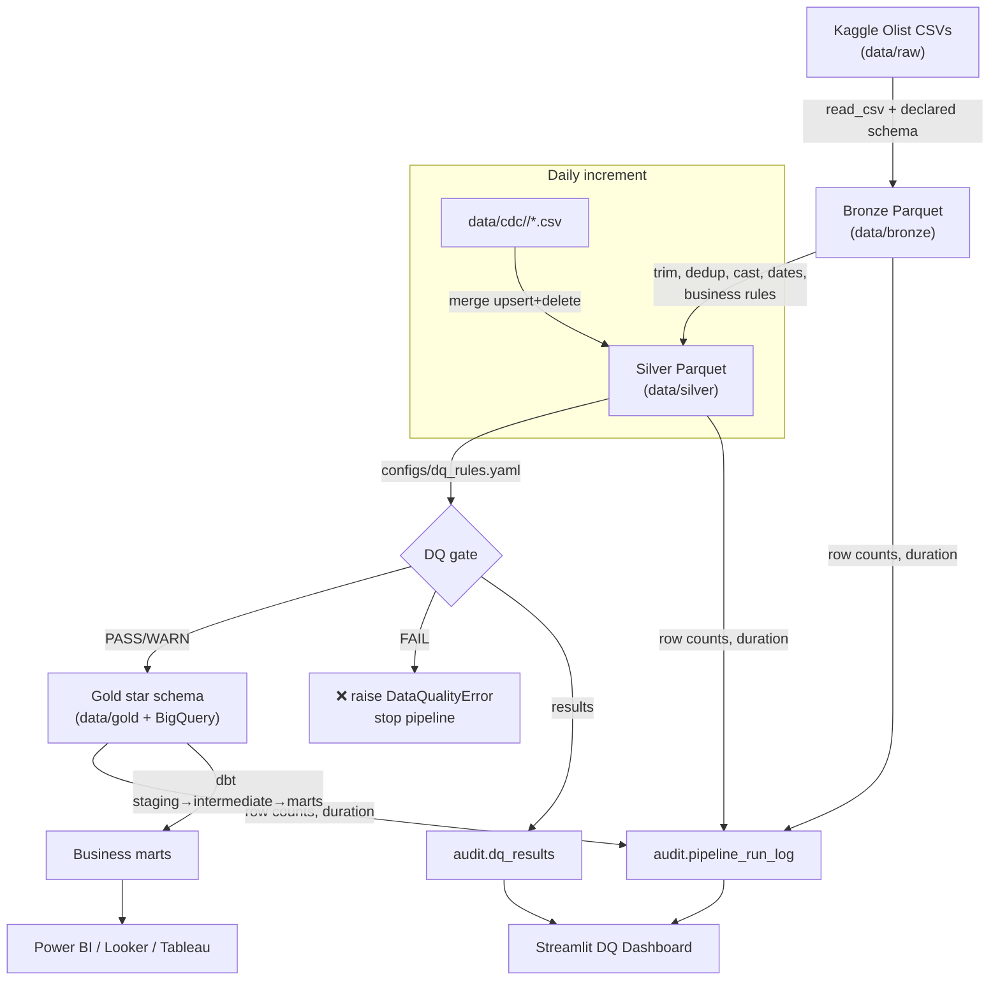

# Data Flow

End-to-end flow of a single pipeline run.

## Per-stage detail

| # | Stage | Module | Input | Output | Key operations |
|---|-------|--------|-------|--------|----------------|
| 1 | Ingest | `bronze/ingest_raw.py` | `data/raw/*.csv` | `data/bronze/<t>` | declared schema, lineage, partition by ingest_date |
| 2 | Clean | `silver/run_silver.py` | bronze | `data/silver/<t>` | trim, null→default, dedup on PK, cast, standardize, format dates, business rules |
| 3 | Validate | `data_quality/run_dq.py` | silver | `audit.dq_results` | nulls, dupes, PK uniqueness, RI, invalid timestamps, FK refs |
| 4 | Curate | `gold/run_gold.py` | silver | `data/gold/*` + BigQuery | build dims+facts, partition+cluster, load BQ |
| 5 | Model | `dbt run` | `ecom_gold` | `*_marts.*` | staging→intermediate→marts metrics |
| 6 | Test | `dbt test` | marts | test results | not_null/unique/relationships/range |
| 7 | Publish | `monitoring/publish_audit.py` | local audit | `ecom_audit.*` | load audit to BQ for dashboards |
| CDC | Increment | `cdc/cdc_processor.py` | `data/cdc/<date>` | silver | upsert + soft delete merge |

## Row-count & lineage tracking

Every Spark stage wraps its work in `audit.track_stage(...)`, capturing
`rows_in`, `rows_out`, `duration_sec` and `status` per (run, stage, table) into
`pipeline_run_log`. This drives the dashboard's **row-count tracking** and
**execution-time** panels, and provides operational **data lineage**
(see [`monitoring/lineage.md`](../monitoring/lineage.md)).
