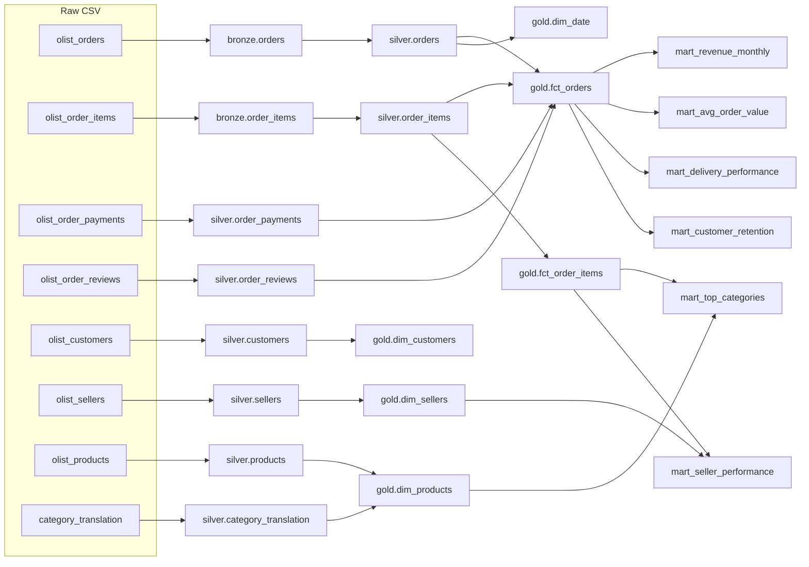

# Data Lineage

Operational lineage is captured automatically in `audit.pipeline_run_log`
(one row per run/stage/table). The logical lineage of each Gold/mart table is
documented here and in `dbt docs`.

## Column-level notes

- `fct_orders.order_value` ← Σ(`order_items.price + freight_value`) per order.
- `fct_orders.avg_review_score` ← AVG(`order_reviews.review_score`) per order.
- `dim_products.category` ← `products.product_category_name` translated via
  `category_translation` (EN), falling back to the PT name.
- `mart_customer_retention.cohort_month` ← MIN(`order_month`) per
  `customer_unique_id`.
